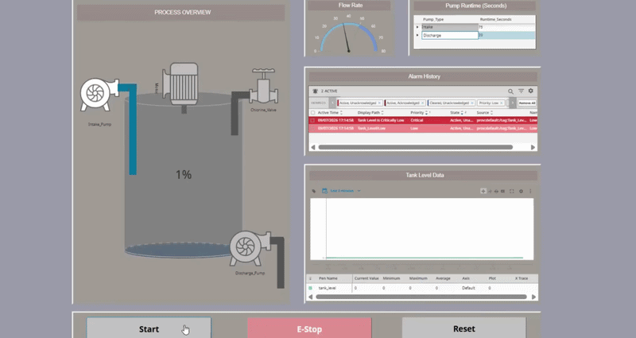

# SCADA-Water-Treatment

## Process Overview using Plant States
The PLC logic uses sequential numbered states to determine the logic sequence. 
* **State 0:** The system is completely off.
* **State 1:** The system turns on, and the intake pump activates to flow water into the tank.
* **State 2:** The mixer motor spins and the chlorine pump is activated for a 5-second treatment cycle.
* **State 3:** The discharge pump activates to move the treated water away.
* **State 99:** Triggered by an E-Stop press or active alarm. All equipment turns off and stays locked out until the manual reset button is pressed.

## Applications used
* **HMI/SCADA Front-End:** Inductive Automation Ignition (Perspective Module).
* **PLC Back-End:** CODESYS V3 using Ladder Logic
* **Communication:** Modbus TPC over Ethernet IP to connect the PLC to the Ignition Gateway.
* **Design Style:** ISA-101
* **Network:** Managed IP address assignment and local port routing for the Modbus TCP driver.

## Key Engineering Features
  - I/O inputs: linked Modbus Discrete Inputs (DI) and Holding Registers (HR) on CODESYS to their corresponding Ignition tags.
  - User-Defined Types (UDTs) to standardize pump instances to ensure it's scalable.
  - Implemented retentive memory in CODESYS for pump runtime even when the PLC is shut-down and turned back on again.
  - Emergency Stop logic as a top-priority Normally Closed (NC) rung in the PLC.
  - Real-time alarming
  - Data historian to create a Trend Chart that visualizes tank levels overtime.
  - Map transforms and Property Bindings to change PLC booleans into easily readable status colors.
  - Troubleshot data collection and tag errors between the PLC and HMI during startup and the simulation.
 
## Project Demonstrations

### 1. Process Lifecycle & Trending

*Normal Operation phases, alongside Flow Rate monitoring and a Historical Data Plotting Graph*

### 2. Safety Override (E-Stop Interlock)
`[Insert Link/GIF to Video 2]`
*Demonstrates the Start -> E-Stop -> Reset sequence, proving the hard-coded PLC interlock successfully overrides active SCADA pump commands.*

### 3. Diagnostic Alarms (Split-Screen)
`[Insert Link/GIF to Video 3]`
*A split-screen view showing the CODESYS ladder logic triggering the high-level overflow sensor and the resulting critical fault appearing in the Ignition Alarm Status Table.*

---
